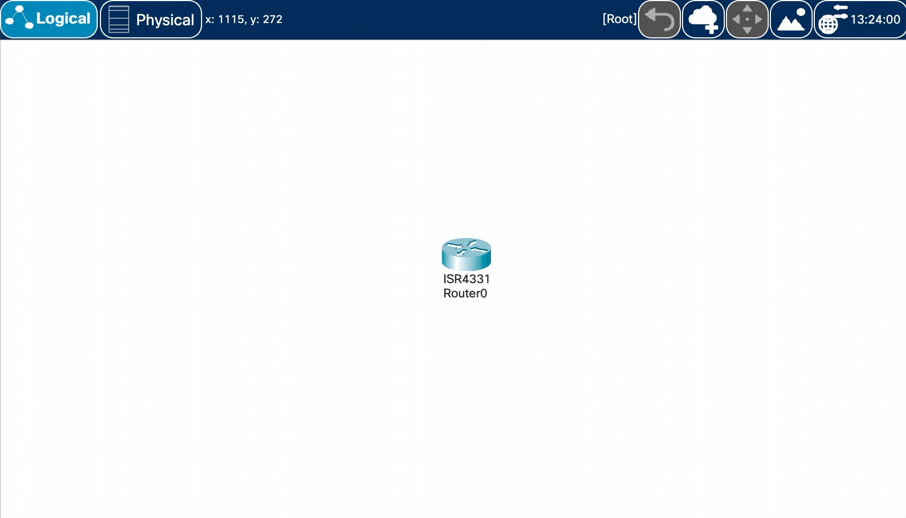
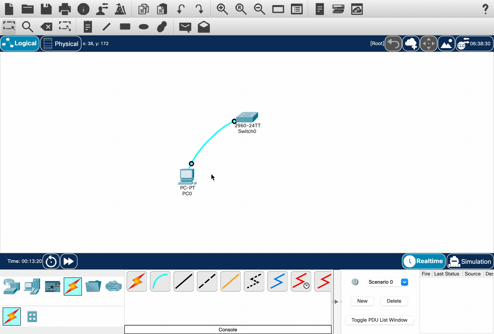
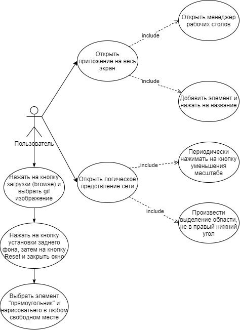

# Практическая работа №1

Командная работа по специфицированию и тестированию.

## Содержание

- [Описание тестируемого ПО](#description-of-tested-software)
- [Установка тестируемого ПО](#installing-the-tested-software)
- [Среда тестирования](#test-environment)
- [Выявленные ошибки/баги](#bugs)
- [Диаграмма вариантов использования](#use-case)

## Описание тестируемого ПО 

Наименование: **Cisco Packet Tracer**

Версия: **8.0.1.0064**

## Установка тестируемого ПО 

Для загрузки и использования Cisco Packet Tracer вам неободима учетная запись Cisco Network Academy.

### Процесс создания учётной записи:

1. Чтобы создать учетную запись Cisco Network Academy, перейдите [по данной ссылке](https://www.netacad.com/ru/courses/) и нажмите на кнопку **"Зарегистрируйтесь уже сегодня!"**.
2. После откроется страница регистрации, где нужно будет заполните и отправить все необходимые данные.
3. Подтвердите учётную запись, перейдя по ссылке из письма, отправленного на вашу эл. почту.

### Скачивание Cisco Packet Tracer:

1. Перейдите на главную страницу [NetAcad](https://www.netacad.com/) и авторизируйтесь.
2. После того как вы вошли, нужно нажать в верхнем меню **Ресурсы -> Загрузить Packet Tracer**.
3. Загрузите необходимую версию под вашу операционную систему.

*PS*: при первом запуске программы необходимо авторизироваться под учетной записью NetAcad.

## Среда тестирования 

Тестирование происходило на следующих операционных системах:

* macOS Big Sur 11
* Microsoft Windows 10

# Выявленные ошибки/баги 

## #1 Выделение не пропадает

**Платформы:**

- [x] macOS Big Sur 11
- [x] Microsoft Windows 10

**Шаги воспроизведения:**

1. Открыть логическое представление сети
2. Зажать ЛКМ
3. Произвести выделение области в любом направлении, кроме того, которое направлено в правый нижний угол
4. Отпустить ЛКМ

**Фактический результат:**

Выделение остаётся.

**Ожидаемый результат:**

Выделение пропадает моментально.

**Демонстрация:**

## #2 Появляется чёрный экран

**Платформы:**

- [x] macOS Big Sur 11
- [ ] Microsoft Windows 10

**Шаги воспроизведения:**

1. Открыть приложение в режиме полного экрана
2. Открыть менеджер рабочих экранов

**Фактический результат:**

Появляется чёрный экран.

**Ожидаемый результат:**

Никакие дополнительные экраны не появляются.

**Демонстрация:**

## #3 Переименование элемента в отдельном окне

**Платформы:**

- [x] macOS Big Sur 11
- [ ] Microsoft Windows 10

**Шаги воспроизведения:**

1. Открыть приложение в режиме полного экрана
2. Добавить любой элемент на поле
3. Один раз нажать ЛКМ на название элемента

**Фактический результат:**

Открывается второй чёрный экран с белым полем для переименования.

**Ожидаемый результат:**

Редактирование названия элемента осуществляется в окне приложения.

**Демонстрация:**

## #4 Инверсный зум

**Платформы:**

- [x] macOS Big Sur 11
- [x] Microsoft Windows 10

**Шаги воспроизведения:**

1. Открыть логическое представление сети
2. Периодически нажимать на кнопку уменьшения масшатаба

**Фактический результат:**

Отображение логического представления сети становится зеркальным и осуществляется приближение.

**Ожидаемый результат:**

Масштаб уменьшается до своего предела как в физическом представлении сети.

**Демонстрация:**

## Диаграмма вариантов использования для воспроизведения багов 

